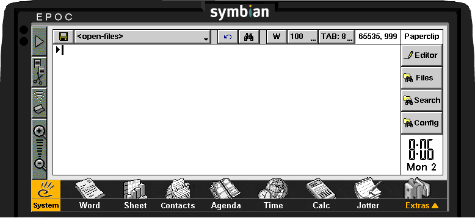

# Paperclip #

Under development, more details to come later.  
Stare at this mockup for now:

## Directory Structure ##

* **aif/**
  "Application Icon File". This directory contains the source data and build scripts to generate the application icon (and metadata) file

* **group/**
  The 'project' files that define the whole project's content and structure. Scripts are provided for compiling the source and generating a _Microsoft Visual C++ 6_ project file

* **hlp/**
  Source files and scripts to generate the help file for the application

* **mbm/**
  "Multi BitMap file". The source files and scripts to generate the bitmap bundle that the application uses for its toolbar icons

* **rsc/** The resource file defines the toolbars and menus in the app but is assembled separately from the main executable

* **sis/** Scripts to generate the installer file (_".sis"_) for use on real EPOC32 devices

* **src/** The C++ source code files. These cannot be built on their own due to dependence on the other resources being pre-compiled and present; use the build scripts below:

* **build_deb.bat** Batch script to build a debug release and launch the EPOC32 'emulator' (although the binaries themselves are x86)

* **build_rel.bat** Batch script to build a final release. The script compiles and launches a release-ready version of the app for the EPOC32 emulator, for final testing, as well as the native ARM binaries. A _".sis"_ installation file is generated for running on native hardware